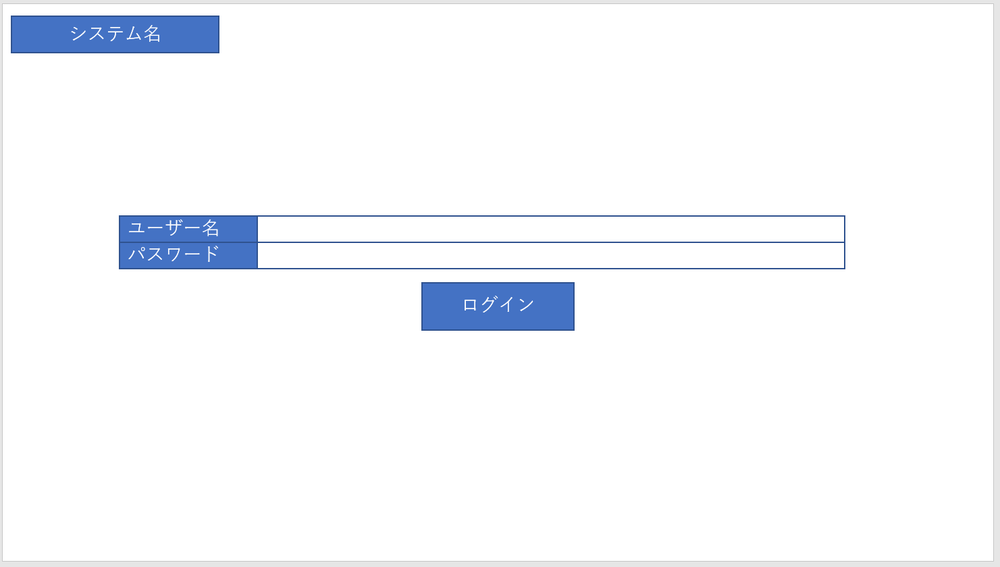

# ログイン機能

<!-- @import "[TOC]" {cmd="toc" depthFrom=1 depthTo=6 orderedList=false} -->

<!-- code_chunk_output -->

- [ログイン機能](#ログイン機能)
  - [1.概要](#1概要)
  - [2.画面構成](#2画面構成)
  - [3.入力](#3入力)
    - [3.1.ユーザー名](#31ユーザー名)
      - [3.1.1.項目名](#311項目名)
      - [3.1.2.入力規則](#312入力規則)
      - [3.1.4.その他](#314その他)
    - [3.2.パスワード](#32パスワード)
      - [3.2.1.項目名](#321項目名)
      - [3.2.2.入力規則](#322入力規則)
      - [3.2.4.その他](#324その他)
  - [4.出力](#4出力)
  - [5.アクション](#5アクション)
    - [5.1.ログイン](#51ログイン)
      - [5.1.1.項目名](#511項目名)
      - [5.1.2.処理内容](#512処理内容)
      - [5.1.3. その他](#513-その他)

<!-- /code_chunk_output -->

## 1.概要

ログイン機能を提供し、システムの利用者を特定および限定を行う

## 2.画面構成

## 3.入力

### 3.1.ユーザー名

#### 3.1.1.項目名

- userName

#### 3.1.2.入力規則

以下の種類の文字のみ対応し、それ以外の文字が入力された場合、バリデーションエラーとする

- 半角数字
- 半角英小文字
- 半角英大文字

#### 3.1.4.その他

- 特になし

### 3.2.パスワード

#### 3.2.1.項目名

- password

#### 3.2.2.入力規則

以下の種類の文字のみ対応し、それ以外の文字が入力された場合、バリデーションエラーとする

- 半角数字
- 半角英小文字
- 半角英大文字
- 半角記号

#### 3.2.4.その他

- 入力された文字列はすべて「●」として表示する

## 4.出力

特になし

## 5.アクション

### 5.1.ログイン

#### 5.1.1.項目名

- loginAction

#### 5.1.2.処理内容

- 入力されたユーザー名およびパスワードが完全一致するユーザーを取得し、次画面へ遷移する
- ユーザーを取得できない場合は、エラーメッセージを表示する
- 入力されたパスワードはハッシュ関数を用いて、暗号化する

#### 5.1.3. その他

特になし
