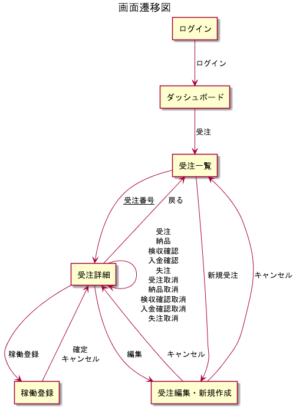

# 全体仕様書

<!-- @import "[TOC]" {cmd="toc" depthFrom=1 depthTo=6 orderedList=false} -->

<!-- code_chunk_output -->

- [全体仕様書](#全体仕様書)
  - [1.システム名](#1システム名)
  - [2.各種フォーマット](#2各種フォーマット)
    - [2.1.日時](#21日時)
      - [2.1.1.フォーマット](#211フォーマット)
      - [2.1.2.例外](#212例外)
    - [2.2.日付](#22日付)
      - [2.2.1.フォーマット](#221フォーマット)
        - [2.2.2.例外](#222例外)
    - [2.3.時間](#23時間)
      - [2.3.1.フォーマット](#231フォーマット)
        - [2.3.2.例外](#232例外)
    - [2.4.金額](#24金額)
      - [2.4.1.フォーマット](#241フォーマット)
        - [2.4.2.例外](#242例外)
    - [2.5.アルファベット](#25アルファベット)
      - [2.5.1.フォーマット](#251フォーマット)
        - [2.5.2.例外](#252例外)
    - [2.6.名前](#26名前)
      - [2.6.1.フォーマット](#261フォーマット)
        - [2.6.2.例外](#262例外)
    - [2.7.小数点](#27小数点)
      - [2.7.1.フォーマット](#271フォーマット)
        - [2.7.2.例外](#272例外)
    - [2.8.百分率](#28百分率)
      - [2.8.1.フォーマット](#281フォーマット)
        - [2.8.2.例外](#282例外)
    - [2.9.カタカナ](#29カタカナ)
      - [2.9.1.フォーマット](#291フォーマット)
        - [2.9.2.例外](#292例外)
  - [3.画面遷移図](#3画面遷移図)
  - [4.機能一覧](#4機能一覧)

<!-- /code_chunk_output -->

本仕様書はシステム全体の仕様を定義する。

## 1.システム名

- 正式名称
- 略称
  - SLOrder

## 2.各種フォーマット

### 2.1.日時

#### 2.1.1.フォーマット

- yyyy/MM/DD HH:Mi:SS

#### 2.1.2.例外

  *特になし

### 2.2.日付

#### 2.2.1.フォーマット

- yyyy/MM/DD

##### 2.2.2.例外

- 特になし

### 2.3.時間

#### 2.3.1.フォーマット

- HH:Mi:SS

##### 2.3.2.例外

- 特になし

### 2.4.金額

#### 2.4.1.フォーマット

- 日本円単位にて、3桁区切りで「,」を出力

##### 2.4.2.例外

- 特になし

### 2.5.アルファベット

#### 2.5.1.フォーマット

- 半角小文字

##### 2.5.2.例外

- 社名や商標などに大文字が使われている場合は、大文字のまま出力する

### 2.6.名前

#### 2.6.1.フォーマット

- 氏 名

##### 2.6.2.例外

- 特になし

### 2.7.小数点

#### 2.7.1.フォーマット

- 小数点第2位まで

##### 2.7.2.例外

- 特になし

### 2.8.百分率

#### 2.8.1.フォーマット

- パーセンテージ以降、小数点第2位まで

##### 2.8.2.例外

- 特になし

### 2.9.カタカナ

#### 2.9.1.フォーマット

- 全角カタカナのみ

##### 2.9.2.例外

- 特になし

## 3.画面遷移図

## 4.機能一覧

- ログイン機能
- ダッシュボード機能
- 受注機能
- ~~顧客機能~~ 今後実装予定
- ~~メンバー機能~~ 今後実装予定
- ~~収支報告機能~~ 今後実装予定
- ~~管理機能~~ 今後実装予定
