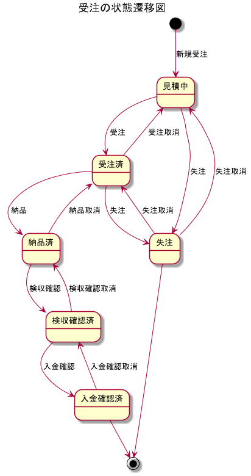
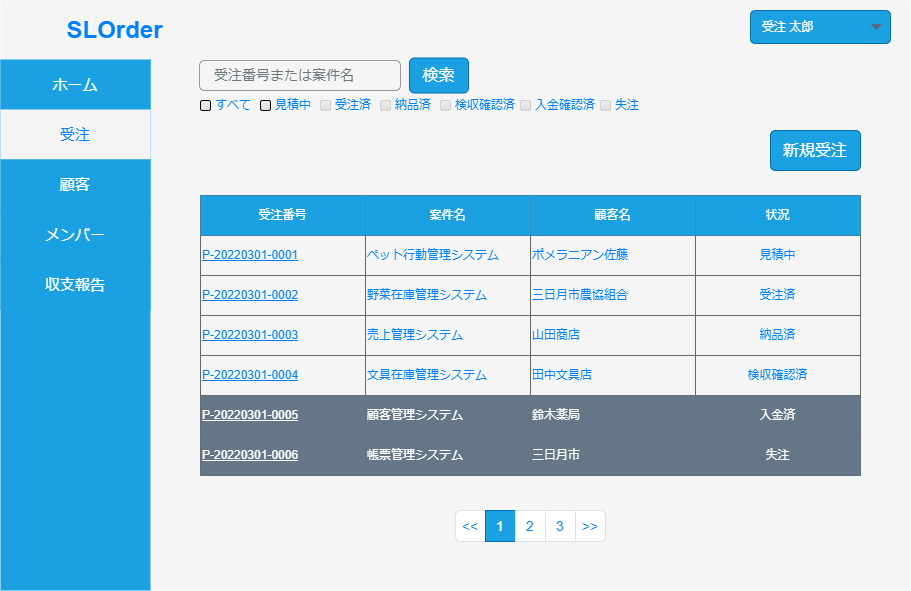
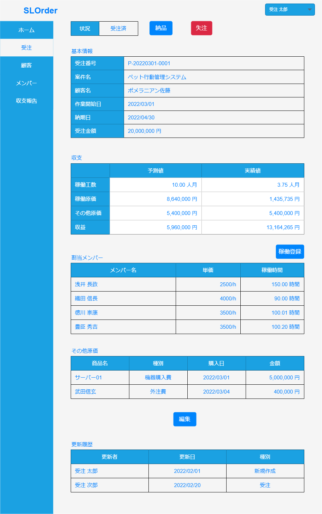

# 1. 受注機能仕様書

<!-- @import "[TOC]" {cmd="toc" depthFrom=1 depthTo=6 orderedList=false} -->

<!-- code_chunk_output -->

- [1. 受注機能仕様書](#1-受注機能仕様書)
  - [1.1. 概要](#11-概要)
  - [1.2. 受注一覧画面](#12-受注一覧画面)
    - [1.2.1. 画面サンプル](#121-画面サンプル)
    - [1.2.2. 入力](#122-入力)
      - [1.2.2.1. 検索ボックス](#1221-検索ボックス)
        - [1.2.2.1.1. 入力内容](#12211-入力内容)
        - [1.2.2.1.2. 入力形式](#12212-入力形式)
        - [1.2.2.1.3. デフォルト値](#12213-デフォルト値)
        - [1.2.2.1.4. バリデーション](#12214-バリデーション)
        - [1.2.2.1.5. その他特記事項](#12215-その他特記事項)
      - [1.2.2.2. すべて](#1222-すべて)
        - [1.2.2.2.1. 入力内容](#12221-入力内容)
        - [1.2.2.2.2. 入力形式](#12222-入力形式)
        - [1.2.2.2.3. デフォルト値](#12223-デフォルト値)
        - [1.2.2.2.4. バリデーション](#12224-バリデーション)
        - [1.2.2.2.5. その他特記事項](#12225-その他特記事項)
      - [1.2.2.3. 見積中](#1223-見積中)
        - [1.2.2.3.1. 入力内容](#12231-入力内容)
        - [1.2.2.3.2. 入力形式](#12232-入力形式)
        - [1.2.2.3.3. デフォルト値](#12233-デフォルト値)
        - [1.2.2.3.4. バリデーション](#12234-バリデーション)
        - [1.2.2.3.5. その他特記事項](#12235-その他特記事項)
      - [1.2.2.4. 受注済](#1224-受注済)
        - [1.2.2.4.1. 入力内容](#12241-入力内容)
        - [1.2.2.4.2. 入力形式](#12242-入力形式)
        - [1.2.2.4.3. デフォルト値](#12243-デフォルト値)
        - [1.2.2.4.4. バリデーション](#12244-バリデーション)
        - [1.2.2.4.5. その他特記事項](#12245-その他特記事項)
      - [1.2.2.5. 納品済](#1225-納品済)
        - [1.2.2.5.1. 入力内容](#12251-入力内容)
        - [1.2.2.5.2. 入力形式](#12252-入力形式)
        - [1.2.2.5.3. デフォルト値](#12253-デフォルト値)
        - [1.2.2.5.4. バリデーション](#12254-バリデーション)
        - [1.2.2.5.5. その他特記事項](#12255-その他特記事項)
      - [1.2.2.6. 検収確認済](#1226-検収確認済)
        - [1.2.2.6.1. 入力内容](#12261-入力内容)
        - [1.2.2.6.2. 入力形式](#12262-入力形式)
        - [1.2.2.6.3. デフォルト値](#12263-デフォルト値)
        - [1.2.2.6.4. バリデーション](#12264-バリデーション)
        - [1.2.2.6.5. その他特記事項](#12265-その他特記事項)
      - [1.2.2.7. 入金確認済](#1227-入金確認済)
        - [1.2.2.7.1. 入力内容](#12271-入力内容)
        - [1.2.2.7.2. 入力形式](#12272-入力形式)
        - [1.2.2.7.3. デフォルト値](#12273-デフォルト値)
        - [1.2.2.7.4. バリデーション](#12274-バリデーション)
        - [1.2.2.7.5. その他特記事項](#12275-その他特記事項)
      - [1.2.2.8. 失注](#1228-失注)
        - [1.2.2.8.1. 入力内容](#12281-入力内容)
        - [1.2.2.8.2. 入力形式](#12282-入力形式)
        - [1.2.2.8.3. デフォルト値](#12283-デフォルト値)
        - [1.2.2.8.4. バリデーション](#12284-バリデーション)
        - [1.2.2.8.5. その他特記事項](#12285-その他特記事項)
    - [1.2.3. 出力](#123-出力)
      - [1.2.3.1. 受注案件一覧](#1231-受注案件一覧)
        - [1.2.3.1.1. 出力内容](#12311-出力内容)
        - [1.2.3.1.2. 出力形式](#12312-出力形式)
        - [1.2.3.1.3. その他特記事項](#12313-その他特記事項)
      - [1.2.3.2. 受注番号](#1232-受注番号)
        - [1.2.3.2.1. 出力内容](#12321-出力内容)
        - [1.2.3.2.2. 出力形式](#12322-出力形式)
        - [1.2.3.2.3. その他特記事項](#12323-その他特記事項)
      - [1.2.3.3. 案件名](#1233-案件名)
        - [1.2.3.3.1. 出力内容](#12331-出力内容)
        - [1.2.3.3.2. 出力形式](#12332-出力形式)
        - [1.2.3.3.3. その他特記事項](#12333-その他特記事項)
      - [1.2.3.4. 顧客名](#1234-顧客名)
        - [1.2.3.4.1. 出力内容](#12341-出力内容)
        - [1.2.3.4.2. 出力形式](#12342-出力形式)
        - [1.2.3.4.3. その他特記事項](#12343-その他特記事項)
      - [1.2.3.5. 状況](#1235-状況)
        - [1.2.3.5.1. 出力内容](#12351-出力内容)
        - [1.2.3.5.2. 出力形式](#12352-出力形式)
        - [1.2.3.5.3. その他特記事項](#12353-その他特記事項)
    - [1.2.4. アクション](#124-アクション)
      - [1.2.4.1. 検索](#1241-検索)
        - [1.2.4.1.1. 種類](#12411-種類)
        - [1.2.4.1.2. トリガー](#12412-トリガー)
        - [1.2.4.1.3. 動作内容](#12413-動作内容)
        - [1.2.4.1.4. その他特記事項](#12414-その他特記事項)
      - [1.2.4.2. すべて](#1242-すべて)
        - [1.2.4.2.1. 種類](#12421-種類)
        - [1.2.4.2.2. トリガー](#12422-トリガー)
        - [1.2.4.2.3. 動作内容](#12423-動作内容)
        - [1.2.4.2.4. その他特記事項](#12424-その他特記事項)
      - [1.2.4.3. 見積中](#1243-見積中)
        - [1.2.4.3.1. 種類](#12431-種類)
        - [1.2.4.3.2. トリガー](#12432-トリガー)
        - [1.2.4.3.3. 動作内容](#12433-動作内容)
        - [1.2.4.3.4. その他特記事項](#12434-その他特記事項)
      - [1.2.4.4. 受注済](#1244-受注済)
        - [1.2.4.4.1. 種類](#12441-種類)
        - [1.2.4.4.2. トリガー](#12442-トリガー)
        - [1.2.4.4.3. 動作内容](#12443-動作内容)
        - [1.2.4.4.4. その他特記事項](#12444-その他特記事項)
      - [1.2.4.5. 納品済](#1245-納品済)
        - [1.2.4.5.1. 種類](#12451-種類)
        - [1.2.4.5.2. トリガー](#12452-トリガー)
        - [1.2.4.5.3. 動作内容](#12453-動作内容)
        - [1.2.4.5.4. その他特記事項](#12454-その他特記事項)
      - [1.2.4.6. 検収確認済](#1246-検収確認済)
        - [1.2.4.6.1. 種類](#12461-種類)
        - [1.2.4.6.2. トリガー](#12462-トリガー)
        - [1.2.4.6.3. 動作内容](#12463-動作内容)
        - [1.2.4.6.4. その他特記事項](#12464-その他特記事項)
      - [1.2.4.7. 失注](#1247-失注)
        - [1.2.4.7.1. 種類](#12471-種類)
        - [1.2.4.7.2. トリガー](#12472-トリガー)
        - [1.2.4.7.3. 動作内容](#12473-動作内容)
        - [1.2.4.7.4. その他特記事項](#12474-その他特記事項)
      - [1.2.4.8. 新規受注](#1248-新規受注)
        - [1.2.4.8.1. 種類](#12481-種類)
        - [1.2.4.8.2. トリガー](#12482-トリガー)
        - [1.2.4.8.3. 動作内容](#12483-動作内容)
        - [1.2.4.8.4. その他特記事項](#12484-その他特記事項)
      - [1.2.4.9. 受注番号](#1249-受注番号)
        - [1.2.4.9.1. 種類](#12491-種類)
        - [1.2.4.9.2. トリガー](#12492-トリガー)
        - [1.2.4.9.3. 動作内容](#12493-動作内容)
        - [1.2.4.9.4. その他特記事項](#12494-その他特記事項)
      - [1.2.4.10. ページセレクタ](#12410-ページセレクタ)
        - [1.2.4.10.1. 種類](#124101-種類)
        - [1.2.4.10.2. トリガー](#124102-トリガー)
        - [1.2.4.10.3. 動作内容](#124103-動作内容)
        - [1.2.4.10.4. その他特記事項](#124104-その他特記事項)
  - [1.3. 受注詳細画面](#13-受注詳細画面)
    - [1.3.1. 画面サンプル](#131-画面サンプル)
    - [1.3.2. 入力](#132-入力)
    - [1.3.3. 出力](#133-出力)
      - [1.3.3.1. 状況](#1331-状況)
        - [1.3.3.1.1. 出力内容](#13311-出力内容)
        - [1.3.3.1.2. 出力形式](#13312-出力形式)
        - [1.3.3.1.3. その他特記事項](#13313-その他特記事項)
      - [1.3.3.2. 受注番号](#1332-受注番号)
        - [1.3.3.2.1. 出力内容](#13321-出力内容)
        - [1.3.3.2.2. 出力形式](#13322-出力形式)
        - [1.3.3.2.3. その他特記事項](#13323-その他特記事項)
      - [1.3.3.3. 受注名](#1333-受注名)
        - [1.3.3.3.1. 出力内容](#13331-出力内容)
        - [1.3.3.3.2. 出力形式](#13332-出力形式)
        - [1.3.3.3.3. その他特記事項](#13333-その他特記事項)
      - [1.3.3.4. 顧客名](#1334-顧客名)
        - [1.3.3.4.1. 出力内容](#13341-出力内容)
        - [1.3.3.4.2. 出力形式](#13342-出力形式)
        - [1.3.3.4.3. その他特記事項](#13343-その他特記事項)
      - [1.3.3.5. 作業開始日](#1335-作業開始日)
        - [1.3.3.5.1. 出力内容](#13351-出力内容)
        - [1.3.3.5.2. 出力形式](#13352-出力形式)
        - [1.3.3.5.3. その他特記事項](#13353-その他特記事項)
      - [1.3.3.6. 納期日](#1336-納期日)
        - [1.3.3.6.1. 出力内容](#13361-出力内容)
        - [1.3.3.6.2. 出力形式](#13362-出力形式)
        - [1.3.3.6.3. その他特記事項](#13363-その他特記事項)
      - [1.3.3.7. 受注金額](#1337-受注金額)
        - [1.3.3.7.1. 出力内容](#13371-出力内容)
        - [1.3.3.7.2. 出力形式](#13372-出力形式)
        - [1.3.3.7.3. その他特記事項](#13373-その他特記事項)
      - [1.3.3.8. 稼働工数 予測値](#1338-稼働工数-予測値)
        - [1.3.3.8.1. 出力内容](#13381-出力内容)
        - [1.3.3.8.2. 出力形式](#13382-出力形式)
        - [1.3.3.8.3. その他特記事項](#13383-その他特記事項)
      - [1.3.3.9. 稼働原価 予測値](#1339-稼働原価-予測値)
        - [1.3.3.9.1. 出力内容](#13391-出力内容)
        - [1.3.3.9.2. 出力形式](#13392-出力形式)
        - [1.3.3.9.3. その他特記事項](#13393-その他特記事項)
      - [1.3.3.10. その他原価 予測値](#13310-その他原価-予測値)
        - [1.3.3.10.1. 出力内容](#133101-出力内容)
        - [1.3.3.10.2. 出力形式](#133102-出力形式)
        - [1.3.3.10.3. その他特記事項](#133103-その他特記事項)
      - [1.3.3.11. 収益 予測値](#13311-収益-予測値)
        - [1.3.3.11.1. 出力内容](#133111-出力内容)
        - [1.3.3.11.2. 出力形式](#133112-出力形式)
        - [1.3.3.11.3. その他特記事項](#133113-その他特記事項)
      - [1.3.3.12. 稼働工数 実績値](#13312-稼働工数-実績値)
        - [1.3.3.12.1. 出力内容](#133121-出力内容)
        - [1.3.3.12.2. 出力形式](#133122-出力形式)
        - [1.3.3.12.3. その他特記事項](#133123-その他特記事項)
      - [1.3.3.13. 稼働原価 実績値](#13313-稼働原価-実績値)
        - [1.3.3.13.1. 出力内容](#133131-出力内容)
        - [1.3.3.13.2. 出力形式](#133132-出力形式)
        - [1.3.3.13.3. その他特記事項](#133133-その他特記事項)
      - [1.3.3.14. その他原価 実績値](#13314-その他原価-実績値)
        - [1.3.3.14.1. 出力内容](#133141-出力内容)
        - [1.3.3.14.2. 出力形式](#133142-出力形式)
        - [1.3.3.14.3. その他特記事項](#133143-その他特記事項)
      - [1.3.3.15. 割当メンバー](#13315-割当メンバー)
        - [1.3.3.15.1. 出力内容](#133151-出力内容)
        - [1.3.3.15.2. 出力形式](#133152-出力形式)
        - [1.3.3.15.3. その他特記事項](#133153-その他特記事項)
      - [1.3.3.16. メンバー名](#13316-メンバー名)
        - [1.3.3.16.1. 出力内容](#133161-出力内容)
        - [1.3.3.16.2. 出力形式](#133162-出力形式)
        - [1.3.3.16.3. その他特記事項](#133163-その他特記事項)
      - [1.3.3.17. 単価](#13317-単価)
        - [1.3.3.17.1. 出力内容](#133171-出力内容)
        - [1.3.3.17.2. 出力形式](#133172-出力形式)
        - [1.3.3.17.3. その他特記事項](#133173-その他特記事項)
      - [1.3.3.18. 稼働時間](#13318-稼働時間)
        - [1.3.3.18.1. 出力内容](#133181-出力内容)
        - [1.3.3.18.2. 出力形式](#133182-出力形式)
        - [1.3.3.18.3. その他特記事項](#133183-その他特記事項)
      - [1.3.3.19. その他原価](#13319-その他原価)
        - [1.3.3.19.1. 出力内容](#133191-出力内容)
        - [1.3.3.19.2. 出力形式](#133192-出力形式)
        - [1.3.3.19.3. その他特記事項](#133193-その他特記事項)
      - [1.3.3.20. 商品名](#13320-商品名)
        - [1.3.3.20.1. 出力内容](#133201-出力内容)
        - [1.3.3.20.2. 出力形式](#133202-出力形式)
        - [1.3.3.20.3. その他特記事項](#133203-その他特記事項)
      - [1.3.3.21. 種別](#13321-種別)
        - [1.3.3.21.1. 出力内容](#133211-出力内容)
        - [1.3.3.21.2. 出力形式](#133212-出力形式)
        - [1.3.3.21.3. その他特記事項](#133213-その他特記事項)
      - [1.3.3.22. 購入日](#13322-購入日)
        - [1.3.3.22.1. 出力内容](#133221-出力内容)
        - [1.3.3.22.2. 出力形式](#133222-出力形式)
        - [1.3.3.22.3. その他特記事項](#133223-その他特記事項)
      - [1.3.3.23. 金額](#13323-金額)
        - [1.3.3.23.1. 出力内容](#133231-出力内容)
        - [1.3.3.23.2. 出力形式](#133232-出力形式)
        - [1.3.3.23.3. その他特記事項](#133233-その他特記事項)
      - [1.3.3.24. 更新履歴](#13324-更新履歴)
        - [1.3.3.24.1. 出力内容](#133241-出力内容)
        - [1.3.3.24.2. 出力形式](#133242-出力形式)
        - [1.3.3.24.3. その他特記事項](#133243-その他特記事項)
      - [1.3.3.25. 更新者](#13325-更新者)
        - [1.3.3.25.1. 出力内容](#133251-出力内容)
        - [1.3.3.25.2. 出力形式](#133252-出力形式)
        - [1.3.3.25.3. その他特記事項](#133253-その他特記事項)
      - [1.3.3.26. 更新日](#13326-更新日)
        - [1.3.3.26.1. 出力内容](#133261-出力内容)
        - [1.3.3.26.2. 出力形式](#133262-出力形式)
        - [1.3.3.26.3. その他特記事項](#133263-その他特記事項)
      - [1.3.3.27. 種別](#13327-種別)
        - [1.3.3.27.1. 出力内容](#133271-出力内容)
        - [1.3.3.27.2. 出力形式](#133272-出力形式)
        - [1.3.3.27.3. その他特記事項](#133273-その他特記事項)
    - [1.3.4. アクション](#134-アクション)
      - [1.3.4.1. 受注](#1341-受注)
        - [1.3.4.1.1. 種類](#13411-種類)
        - [1.3.4.1.2. トリガー](#13412-トリガー)
        - [1.3.4.1.3. 動作内容](#13413-動作内容)
        - [1.3.4.1.4. その他特記事項](#13414-その他特記事項)
      - [1.3.4.2. 納品](#1342-納品)
        - [1.3.4.2.1. 種類](#13421-種類)
        - [1.3.4.2.2. トリガー](#13422-トリガー)
        - [1.3.4.2.3. 動作内容](#13423-動作内容)
        - [1.3.4.2.4. その他特記事項](#13424-その他特記事項)
      - [1.3.4.3. 検収確認](#1343-検収確認)
        - [1.3.4.3.1. 種類](#13431-種類)
        - [1.3.4.3.2. トリガー](#13432-トリガー)
        - [1.3.4.3.3. 動作内容](#13433-動作内容)
        - [1.3.4.3.4. その他特記事項](#13434-その他特記事項)
      - [1.3.4.4. 入金確認](#1344-入金確認)
        - [1.3.4.4.1. 種類](#13441-種類)
        - [1.3.4.4.2. トリガー](#13442-トリガー)
        - [1.3.4.4.3. 動作内容](#13443-動作内容)
        - [1.3.4.4.4. その他特記事項](#13444-その他特記事項)
      - [1.3.4.5. 失注](#1345-失注)
        - [1.3.4.5.1. 種類](#13451-種類)
        - [1.3.4.5.2. トリガー](#13452-トリガー)
        - [1.3.4.5.3. 動作内容](#13453-動作内容)
        - [1.3.4.5.4. その他特記事項](#13454-その他特記事項)
      - [1.3.4.6. 受注取消](#1346-受注取消)
        - [1.3.4.6.1. 種類](#13461-種類)
        - [1.3.4.6.2. トリガー](#13462-トリガー)
        - [1.3.4.6.3. 動作内容](#13463-動作内容)
        - [1.3.4.6.4. その他特記事項](#13464-その他特記事項)
      - [1.3.4.7. 納品取消](#1347-納品取消)
        - [1.3.4.7.1. 種類](#13471-種類)
        - [1.3.4.7.2. トリガー](#13472-トリガー)
        - [1.3.4.7.3. 動作内容](#13473-動作内容)
        - [1.3.4.7.4. その他特記事項](#13474-その他特記事項)
      - [1.3.4.8. 検収確認取消](#1348-検収確認取消)
        - [1.3.4.8.1. 種類](#13481-種類)
        - [1.3.4.8.2. トリガー](#13482-トリガー)
        - [1.3.4.8.3. 動作内容](#13483-動作内容)
        - [1.3.4.8.4. その他特記事項](#13484-その他特記事項)
      - [1.3.4.9. 入金確認取消](#1349-入金確認取消)
        - [1.3.4.9.1. 種類](#13491-種類)
        - [1.3.4.9.2. トリガー](#13492-トリガー)
        - [1.3.4.9.3. 動作内容](#13493-動作内容)
        - [1.3.4.9.4. その他特記事項](#13494-その他特記事項)
      - [1.3.4.10. 失注取消](#13410-失注取消)
        - [1.3.4.10.1. 種類](#134101-種類)
        - [1.3.4.10.2. トリガー](#134102-トリガー)
        - [1.3.4.10.3. 動作内容](#134103-動作内容)
        - [1.3.4.10.4. その他特記事項](#134104-その他特記事項)
      - [1.3.4.10. 編集](#13410-編集)
        - [1.3.4.10.1. 種類](#134101-種類-1)
        - [1.3.4.10.2. トリガー](#134102-トリガー-1)
        - [1.3.4.10.3. 動作内容](#134103-動作内容-1)
        - [1.3.4.10.4. その他特記事項](#134104-その他特記事項-1)

<!-- /code_chunk_output -->

## 1.1. 概要

本仕様書は受注機能についてまとめたものである。

本機能は顧客からの案件情報を記入し、管理することができる。
受注情報は以下の状態を持つ。

|状態一覧|状態の種類|説明|
|:------|:------|:------|
|見積中|未完了|顧客から受注予定の状態|
|受注済|未完了|顧客から受注して作業中の状態|
|納品済|未完了|顧客に納品して、顧客が検収している状態|
|検収確認済|未完了|顧客の検収が完了して、顧客化からの入金待ちの状態|
|入金確認済|完了済|顧客からの入金が終わり、案件が完了して終了した状態|
|失注|完了済|顧客から失注の連絡があり、案件が未完のまま終了した状態|

以下に、状態遷移図を示す。

## 1.2. 受注一覧画面

受注一覧画面では、今までに受注した案件の一覧を表示する。

### 1.2.1. 画面サンプル

### 1.2.2. 入力

#### 1.2.2.1. 検索ボックス

##### 1.2.2.1.1. 入力内容

表示対象の案件の受注番号または案件名を入力して検索する

##### 1.2.2.1.2. 入力形式

テキストボックス

##### 1.2.2.1.3. デフォルト値

空欄

##### 1.2.2.1.4. バリデーション

特になし。

##### 1.2.2.1.5. その他特記事項

プレースホルダーに「受注番号または案件名を入力」と表示する

#### 1.2.2.2. すべて

##### 1.2.2.2.1. 入力内容

すべての状態の案件を表示対象に含めるか選択する。

##### 1.2.2.2.2. 入力形式

チェックボックス

##### 1.2.2.2.3. デフォルト値

false

##### 1.2.2.2.4. バリデーション

特になし。

##### 1.2.2.2.5. その他特記事項

「すべて」のチェックボックスがtureになったとき、「すべて」以外のチェックボックスはfalseになる。

#### 1.2.2.3. 見積中

##### 1.2.2.3.1. 入力内容

状態が「見積中」の案件を表示対象に含めるか選択する。

##### 1.2.2.3.2. 入力形式

チェックボックス

##### 1.2.2.3.3. デフォルト値

ture

##### 1.2.2.3.4. バリデーション

特になし。

##### 1.2.2.3.5. その他特記事項

「見積中」のチェックボックスがtureになったとき、「すべて」のチェックボックスはfalseになる。

#### 1.2.2.4. 受注済

##### 1.2.2.4.1. 入力内容

状態が「受注済」の案件を表示対象に含めるか選択する。

##### 1.2.2.4.2. 入力形式

チェックボックス

##### 1.2.2.4.3. デフォルト値

ture

##### 1.2.2.4.4. バリデーション

特になし。

##### 1.2.2.4.5. その他特記事項

「受注済」のチェックボックスがtureになったとき、「すべて」のチェックボックスはfalseになる。

#### 1.2.2.5. 納品済

##### 1.2.2.5.1. 入力内容

状態が「納品済」の案件を表示対象に含めるか選択する。

##### 1.2.2.5.2. 入力形式

チェックボックス

##### 1.2.2.5.3. デフォルト値

ture

##### 1.2.2.5.4. バリデーション

特になし。

##### 1.2.2.5.5. その他特記事項

「納品済」のチェックボックスがtureになったとき、「すべて」のチェックボックスはfalseになる。

#### 1.2.2.6. 検収確認済

##### 1.2.2.6.1. 入力内容

状態が「検収確認済」の案件を表示対象に含めるか選択する。

##### 1.2.2.6.2. 入力形式

チェックボックス

##### 1.2.2.6.3. デフォルト値

ture

##### 1.2.2.6.4. バリデーション

特になし。

##### 1.2.2.6.5. その他特記事項

「検収確認済」のチェックボックスがtureになったとき、「すべて」のチェックボックスはfalseになる。

#### 1.2.2.7. 入金確認済

##### 1.2.2.7.1. 入力内容

状態が「入金確認済」の案件を表示対象に含めるか選択する。

##### 1.2.2.7.2. 入力形式

チェックボックス

##### 1.2.2.7.3. デフォルト値

false

##### 1.2.2.7.4. バリデーション

特になし。

##### 1.2.2.7.5. その他特記事項

「入金確認済」のチェックボックスがtureになったとき、「すべて」のチェックボックスはfalseになる。

#### 1.2.2.8. 失注

##### 1.2.2.8.1. 入力内容

状態が「失注」の案件を表示対象に含めるか選択する。

##### 1.2.2.8.2. 入力形式

チェックボックス

##### 1.2.2.8.3. デフォルト値

false

##### 1.2.2.8.4. バリデーション

特になし。

##### 1.2.2.8.5. その他特記事項

「失注」のチェックボックスがtureになったとき、「すべて」のチェックボックスはfalseになる。

### 1.2.3. 出力

#### 1.2.3.1. 受注案件一覧

##### 1.2.3.1.1. 出力内容

システムに登録された案件の一覧を表示する。表示対象のデータは登録されている全データ。
検索ボックスを利用して、表示対象を切り替えることができる。
案件が10件以上存在する場合は、1ページにつき10件表示し、ページセレクタを使用して任意のページに切り替えることができる。

##### 1.2.3.1.2. 出力形式

リスト

##### 1.2.3.1.3. その他特記事項

案件の一覧は、受注番号の昇順とする。
案件の状態が、「入金済」または「失注」の案件の列は グレーアウト(#CCCCCC)にて表示する。

#### 1.2.3.2. 受注番号

##### 1.2.3.2.1. 出力内容

システムに登録された案件の受注番号を表示する。

##### 1.2.3.2.2. 出力形式

P-YYYYMMDD-zzzz

##### 1.2.3.2.3. その他特記事項

特になし。

#### 1.2.3.3. 案件名

##### 1.2.3.3.1. 出力内容

システムに登録された案件の名前を表示する。

##### 1.2.3.3.2. 出力形式

テキスト

##### 1.2.3.3.3. その他特記事項

特になし。

#### 1.2.3.4. 顧客名

##### 1.2.3.4.1. 出力内容

システムに登録された案件を発注した顧客名を表示する。

##### 1.2.3.4.2. 出力形式

テキスト

##### 1.2.3.4.3. その他特記事項

特になし。

#### 1.2.3.5. 状況

##### 1.2.3.5.1. 出力内容

システムに登録された案件の状態を表示する

##### 1.2.3.5.2. 出力形式

テキスト

##### 1.2.3.5.3. その他特記事項

特になし。

### 1.2.4. アクション

#### 1.2.4.1. 検索

##### 1.2.4.1.1. 種類

ボタン

##### 1.2.4.1.2. トリガー

ボタンを押したとき

##### 1.2.4.1.3. 動作内容

取得した案件の一覧から検索ボックスに入力された受注番号または案件名を部分一致で検索し、取得できた案件を表示対象にする。
検索ボックスが空欄の場合、検索処理は行わず、取得した案件の一覧のすべてを表示対象にする。

また、後術の「すべて」、「見積中」、「受注済」、「納品済」、「検収確認済」、「入金確認済」、「失注」のチェックボックスとはAND条件とする。

##### 1.2.4.1.4. その他特記事項

特になし。

#### 1.2.4.2. すべて

##### 1.2.4.2.1. 種類

チェックボックス

##### 1.2.4.2.2. トリガー

チェックボックスが変更されたとき

##### 1.2.4.2.3. 動作内容

取得した案件の一覧からすべての状態の案件を取得し、表示対象にする。

##### 1.2.4.2.4. その他特記事項

特になし。

#### 1.2.4.3. 見積中

##### 1.2.4.3.1. 種類

チェックボックス

##### 1.2.4.3.2. トリガー

チェックボックスが変更されたとき

##### 1.2.4.3.3. 動作内容

取得した案件の一覧から状態が「見積中」の案件を検索し、取得できた案件を表示対象にする。

##### 1.2.4.3.4. その他特記事項

特になし。

#### 1.2.4.4. 受注済

##### 1.2.4.4.1. 種類

チェックボックス

##### 1.2.4.4.2. トリガー

チェックボックスが変更されたとき

##### 1.2.4.4.3. 動作内容

取得した案件の一覧から状態が「受注済」の案件を検索し、取得できた案件を表示対象にする。

##### 1.2.4.4.4. その他特記事項

特になし。

#### 1.2.4.5. 納品済

##### 1.2.4.5.1. 種類

チェックボックス

##### 1.2.4.5.2. トリガー

チェックボックスが変更されたとき

##### 1.2.4.5.3. 動作内容

取得した案件の一覧から状態が「納品済」の案件を検索し、取得できた案件を表示対象にする。

##### 1.2.4.5.4. その他特記事項

特になし。

#### 1.2.4.6. 検収確認済

##### 1.2.4.6.1. 種類

チェックボックス

##### 1.2.4.6.2. トリガー

チェックボックスが変更されたとき

##### 1.2.4.6.3. 動作内容

取得した案件の一覧から状態が「検収確認済」の案件を検索し、取得できた案件を表示対象にする。

##### 1.2.4.6.4. その他特記事項

特になし。

#### 1.2.4.7. 失注

##### 1.2.4.7.1. 種類

チェックボックス

##### 1.2.4.7.2. トリガー

チェックボックスが変更されたとき

##### 1.2.4.7.3. 動作内容

取得した案件の一覧から状態が「失注」の案件を検索し、取得できた案件を表示対象にする。

##### 1.2.4.7.4. その他特記事項

特になし。

#### 1.2.4.8. 新規受注

##### 1.2.4.8.1. 種類

ボタン

##### 1.2.4.8.2. トリガー

ボタンを押したとき

##### 1.2.4.8.3. 動作内容

受注機能の受注編集・新規作成画面に遷移する。

##### 1.2.4.8.4. その他特記事項

特になし。

#### 1.2.4.9. 受注番号

##### 1.2.4.9.1. 種類

リンク

##### 1.2.4.9.2. トリガー

リンクを押したとき

##### 1.2.4.9.3. 動作内容

選択した案件一覧の情報を保持し、受注編集・新規作成画面に遷移する。

##### 1.2.4.9.4. その他特記事項

特になし。

#### 1.2.4.10. ページセレクタ

##### 1.2.4.10.1. 種類

ページセレクタ

##### 1.2.4.10.2. トリガー

ボタンを押したとき

##### 1.2.4.10.3. 動作内容

取得した案件の一覧から10件ずつ表示対象の案件を切り替える。

##### 1.2.4.10.4. その他特記事項

特になし。

## 1.3. 受注詳細画面

受注一覧画面で選択した案件の詳細を表示する。

### 1.3.1. 画面サンプル

### 1.3.2. 入力

特になし。

### 1.3.3. 出力

#### 1.3.3.1. 状況

##### 1.3.3.1.1. 出力内容

受注一覧画面で選択した案件の状態を表示する。

##### 1.3.3.1.2. 出力形式

テキスト

##### 1.3.3.1.3. その他特記事項

案件の状態が、「入金済」または「失注」場合、 グレーアウト(#CCCCCC)にて表示する。

#### 1.3.3.2. 受注番号

##### 1.3.3.2.1. 出力内容

受注一覧画面で選択した案件の受注番号を表示する。

##### 1.3.3.2.2. 出力形式

P-YYYYMMDD-zzzz

##### 1.3.3.2.3. その他特記事項

特になし。

#### 1.3.3.3. 受注名

##### 1.3.3.3.1. 出力内容

受注一覧画面で選択した案件の名前を表示する。

##### 1.3.3.3.2. 出力形式

テキスト

##### 1.3.3.3.3. その他特記事項

特になし。

#### 1.3.3.4. 顧客名

##### 1.3.3.4.1. 出力内容

受注一覧画面で選択した案件の顧客名を表示する。

##### 1.3.3.4.2. 出力形式

テキスト

##### 1.3.3.4.3. その他特記事項

特になし。

#### 1.3.3.5. 作業開始日

##### 1.3.3.5.1. 出力内容

受注一覧画面で選択した案件の作業開始日を表示する。

##### 1.3.3.5.2. 出力形式

YYYY/MM/DD

##### 1.3.3.5.3. その他特記事項

特になし。

#### 1.3.3.6. 納期日

##### 1.3.3.6.1. 出力内容

受注一覧画面で選択した案件の納期日を表示する。

##### 1.3.3.6.2. 出力形式

YYYY/MM/DD

##### 1.3.3.6.3. その他特記事項

特になし。

#### 1.3.3.7. 受注金額

##### 1.3.3.7.1. 出力内容

受注一覧画面で選択した案件の受注金額を表示する。

##### 1.3.3.7.2. 出力形式

money 円

##### 1.3.3.7.3. その他特記事項

特になし。

#### 1.3.3.8. 稼働工数 予測値

##### 1.3.3.8.1. 出力内容

受注一覧画面で選択した案件の予測稼働工数を表示する。

##### 1.3.3.8.2. 出力形式

nf 人月

##### 1.3.3.8.3. その他特記事項

特になし。

#### 1.3.3.9. 稼働原価 予測値

##### 1.3.3.9.1. 出力内容

受注一覧画面で選択した案件の予測稼働原価を表示する。

##### 1.3.3.9.2. 出力形式

money 円

##### 1.3.3.9.3. その他特記事項

特になし。

#### 1.3.3.10. その他原価 予測値

##### 1.3.3.10.1. 出力内容

受注一覧画面で選択した案件の予測その他原価を表示する。

##### 1.3.3.10.2. 出力形式

money 円

##### 1.3.3.10.3. その他特記事項

特になし。

#### 1.3.3.11. 収益 予測値

##### 1.3.3.11.1. 出力内容

受注一覧画面で選択した案件の予測収益を表示する。

##### 1.3.3.11.2. 出力形式

money 円

##### 1.3.3.11.3. その他特記事項

特になし。

#### 1.3.3.12. 稼働工数 実績値

##### 1.3.3.12.1. 出力内容

受注一覧画面で選択した案件の実績稼働工数を計算して表示する。
稼働工数の計算は以下の式で行う。

n人目の割当メンバーの稼働時間 ... t(n)

$\sum_{k=1}^n t(k) \div (8 \times 20)$

##### 1.3.3.12.2. 出力形式

nf 人月

##### 1.3.3.12.3. その他特記事項

特になし。

#### 1.3.3.13. 稼働原価 実績値

##### 1.3.3.13.1. 出力内容

受注一覧画面で選択した案件の実績稼働原価を計算して表示する。
稼働工数の計算は以下の式で行う。

n人目の割当メンバーの稼働時間 ... t(n)\\
n人目の割当メンバーの稼働原価 ... c(n)\\

$\sum_{k=1}^n t(k) \times c(k)$

##### 1.3.3.13.2. 出力形式

money 円

##### 1.3.3.13.3. その他特記事項

特になし。

#### 1.3.3.14. その他原価 実績値

##### 1.3.3.14.1. 出力内容

受注一覧画面で選択した案件の実績その他原価を計算して表示する。
稼働工数の計算は以下の式で行う。

n番目のその他稼働原価の金額 ... o(n)

$\sum_{k=1}^n o(k)$

##### 1.3.3.14.2. 出力形式

money 円

##### 1.3.3.14.3. その他特記事項

特になし。

#### 1.3.3.15. 割当メンバー

##### 1.3.3.15.1. 出力内容

受注一覧画面で選択した案件の割当メンバーの一覧を表示する。

##### 1.3.3.15.2. 出力形式

リスト

##### 1.3.3.15.3. その他特記事項

特になし。

#### 1.3.3.16. メンバー名

##### 1.3.3.16.1. 出力内容

受注一覧画面で選択した案件の割当メンバーの名前を表示する。

##### 1.3.3.16.2. 出力形式

氏 名

##### 1.3.3.16.3. その他特記事項

特になし。

#### 1.3.3.17. 単価

##### 1.3.3.17.1. 出力内容

受注一覧画面で選択した案件の割当メンバーの単価を表示する。

##### 1.3.3.17.2. 出力形式

money/h

##### 1.3.3.17.3. その他特記事項

特になし。

#### 1.3.3.18. 稼働時間

##### 1.3.3.18.1. 出力内容

受注一覧画面で選択した案件の割当メンバーの稼働時間を表示する。

##### 1.3.3.18.2. 出力形式

nf 時間

##### 1.3.3.18.3. その他特記事項

特になし。

#### 1.3.3.19. その他原価

##### 1.3.3.19.1. 出力内容

受注一覧画面で選択した案件のその他原価の一覧を表示する。

##### 1.3.3.19.2. 出力形式

リスト

##### 1.3.3.19.3. その他特記事項

特になし。

#### 1.3.3.20. 商品名

##### 1.3.3.20.1. 出力内容

受注一覧画面で選択した案件のその他原価の名前を表示する。

##### 1.3.3.20.2. 出力形式

テキスト

##### 1.3.3.20.3. その他特記事項

特になし。

#### 1.3.3.21. 種別

##### 1.3.3.21.1. 出力内容

受注一覧画面で選択した案件のその他原価の種別を表示する。

##### 1.3.3.21.2. 出力形式

テキスト

##### 1.3.3.21.3. その他特記事項

特になし。

#### 1.3.3.22. 購入日

##### 1.3.3.22.1. 出力内容

受注一覧画面で選択した案件のその他原価の購入日を表示する。

##### 1.3.3.22.2. 出力形式

YYYY/MM/DD

##### 1.3.3.22.3. その他特記事項

特になし。

#### 1.3.3.23. 金額

##### 1.3.3.23.1. 出力内容

受注一覧画面で選択した案件のその他原価の購入金額を表示する。

##### 1.3.3.23.2. 出力形式

money 円

##### 1.3.3.23.3. その他特記事項

特になし。

#### 1.3.3.24. 更新履歴

##### 1.3.3.24.1. 出力内容

受注一覧画面で選択した案件の更新履歴の一覧を表示する。

##### 1.3.3.24.2. 出力形式

リスト

##### 1.3.3.24.3. その他特記事項

特になし。

#### 1.3.3.25. 更新者

##### 1.3.3.25.1. 出力内容

受注一覧画面で選択した案件の更新履歴の更新者名を表示する。

##### 1.3.3.25.2. 出力形式

氏 名

##### 1.3.3.25.3. その他特記事項

特になし。

#### 1.3.3.26. 更新日

##### 1.3.3.26.1. 出力内容

受注一覧画面で選択した案件の更新履歴の更新日を表示する。

##### 1.3.3.26.2. 出力形式

YYYY/MM/DD

##### 1.3.3.26.3. その他特記事項

特になし。

#### 1.3.3.27. 種別

##### 1.3.3.27.1. 出力内容

受注一覧画面で選択した案件の更新履歴の種類を表示する。

##### 1.3.3.27.2. 出力形式

テキスト

##### 1.3.3.27.3. その他特記事項

特になし。

### 1.3.4. アクション

以下のボタンは受注一覧画面で選択した案件の状態により、表示状態が変動する。

|状態|受注|納品|検収確認|入金確認|失注|受注取消|納品取消|検収確認取消|入金確認取消|失注取消|
|:------|:------|:------|:------|:------|:------|:------|:------|:------|:------|:------|
|見積中|◯|×|×|×|◯|×|×|×|×|×|
|受注済|×|◯|×|×|◯|◯|×|×|×|×|
|納品済|×|×|◯|×|×|×|◯|×|×|×|
|検収確認済|×|×|×|◯|×|×|×|◯|×|×|
|入金確認済|×|×|×|×|×|×|×|×|◯|×|
|失注済|×|×|×|×|×|×|×|×|×|◯|

#### 1.3.4.1. 受注

##### 1.3.4.1.1. 種類

ボタン

##### 1.3.4.1.2. トリガー

ボタンを押したとき

##### 1.3.4.1.3. 動作内容

- 受注一覧画面で選択した案件の状態を「受注済」にする。
- 受注者に操作者の名前を登録する。
- 受注日に操作日時を登録する。
- 更新履歴に以下の情報を登録する。
  - 受注一覧画面で選択した案件のID
  - 受注一覧画面で選択した案件の名前
  - 操作者の名前
  - 操作日時
  - 操作の種類「受注」

##### 1.3.4.1.4. その他特記事項

操作者に「受注」権限が存在しない場合、受注ボタンは表示しない。

#### 1.3.4.2. 納品

##### 1.3.4.2.1. 種類

ボタン

##### 1.3.4.2.2. トリガー

ボタンを押したとき

##### 1.3.4.2.3. 動作内容

- 受注一覧画面で選択した案件の状態を「納品済」にする。
- 納品責任者に操作者の名前を登録する。
- 納品日に操作日時を登録する。
- 受注メンバーの割当解除日に操作日時を登録する。
- 更新履歴に以下の情報を登録する。
  - 受注一覧画面で選択した案件のID
  - 受注一覧画面で選択した案件の名前
  - 操作者の名前
  - 操作日時
  - 操作の種類「納品」

##### 1.3.4.2.4. その他特記事項

操作者に「納品」権限が存在しない場合、納品ボタンは表示しない。

#### 1.3.4.3. 検収確認

##### 1.3.4.3.1. 種類

ボタン

##### 1.3.4.3.2. トリガー

ボタンを押したとき

##### 1.3.4.3.3. 動作内容

- 受注一覧画面で選択した案件の状態を「検収確認済」にする。
- 検収確認者に操作者の名前を登録する。
- 検収確認日に操作日時を登録する。
- 更新履歴に以下の情報を登録する。
  - 受注一覧画面で選択した案件のID
  - 受注一覧画面で選択した案件の名前
  - 操作者の名前
  - 操作日時
  - 操作の種類「検収確認」

##### 1.3.4.3.4. その他特記事項

操作者に「検収確認」権限が存在しない場合、検収確認ボタンは表示しない。

#### 1.3.4.4. 入金確認

##### 1.3.4.4.1. 種類

ボタン

##### 1.3.4.4.2. トリガー

ボタンを押したとき

##### 1.3.4.4.3. 動作内容

- 受注一覧画面で選択した案件の状態を「入金確認済」にする。
- 入金確認者に操作者の名前を登録する。
- 入金確認日に操作日時を登録する。
- 更新履歴に以下の情報を登録する。
  - 受注一覧画面で選択した案件のID
  - 受注一覧画面で選択した案件の名前
  - 操作者の名前
  - 操作日時
  - 操作の種類「入金確認」

##### 1.3.4.4.4. その他特記事項

操作者に「入金確認」権限が存在しない場合、入金確認ボタンは表示しない。

#### 1.3.4.5. 失注

##### 1.3.4.5.1. 種類

ボタン

##### 1.3.4.5.2. トリガー

ボタンを押したとき

##### 1.3.4.5.3. 動作内容

- 受注一覧画面で選択した案件の状態を「失注済」にする。
- 失注日に操作日時を登録する。
- 更新履歴に以下の情報を登録する。
  - 受注一覧画面で選択した案件のID
  - 受注一覧画面で選択した案件の名前
  - 操作者の名前
  - 操作日時
  - 操作の種類「失注」

##### 1.3.4.5.4. その他特記事項

操作者に「失注」権限が存在しない場合、失注ボタンは表示しない。

#### 1.3.4.6. 受注取消

##### 1.3.4.6.1. 種類

ボタン

##### 1.3.4.6.2. トリガー

ボタンを押したとき

##### 1.3.4.6.3. 動作内容

- 受注一覧画面で選択した案件の状態を「見積中」にする。
- 受注者に登録されている情報を削除する。
- 受注日に登録されている情報を削除する。
- 更新履歴に以下の情報を登録する。
  - 受注一覧画面で選択した案件のID
  - 受注一覧画面で選択した案件の名前
  - 操作者の名前
  - 操作日時
  - 操作の種類「受注取消」

##### 1.3.4.6.4. その他特記事項

操作者に「受注取消」権限が存在しない場合、受注取消ボタンは表示しない。

#### 1.3.4.7. 納品取消

##### 1.3.4.7.1. 種類

ボタン

##### 1.3.4.7.2. トリガー

ボタンを押したとき

##### 1.3.4.7.3. 動作内容

- 受注一覧画面で選択した案件の状態を「受注済」にする。
- 納品責任者に登録されている情報を削除する。
- 納品日に登録されている情報を削除する。
- 更新履歴に以下の情報を登録する。
  - 受注一覧画面で選択した案件のID
  - 受注一覧画面で選択した案件の名前
  - 操作者の名前
  - 操作日時
  - 操作の種類「納品取消」

##### 1.3.4.7.4. その他特記事項

操作者に「納品取消」権限が存在しない場合、納品取消ボタンは表示しない。

#### 1.3.4.8. 検収確認取消

##### 1.3.4.8.1. 種類

ボタン

##### 1.3.4.8.2. トリガー

ボタンを押したとき

##### 1.3.4.8.3. 動作内容

- 受注一覧画面で選択した案件の状態を「納品済」にする。
- 検収確認者に登録されている情報を削除する。
- 検収確認日に登録されている情報を削除する。
- 更新履歴に以下の情報を登録する。
  - 受注一覧画面で選択した案件のID
  - 受注一覧画面で選択した案件の名前
  - 操作者の名前
  - 操作日時
  - 操作の種類「検収確認取消」

##### 1.3.4.8.4. その他特記事項

操作者に「検収確認取消」権限が存在しない場合、検収確認取消ボタンは表示しない。

#### 1.3.4.9. 入金確認取消

##### 1.3.4.9.1. 種類

ボタン

##### 1.3.4.9.2. トリガー

ボタンを押したとき

##### 1.3.4.9.3. 動作内容

- 受注一覧画面で選択した案件の状態を「検収確認済」にする。
- 入金確認者に登録されている情報を削除する。
- 入金確認日に登録されている情報を削除する。
- 更新履歴に以下の情報を登録する。
  - 受注一覧画面で選択した案件のID
  - 受注一覧画面で選択した案件の名前
  - 操作者の名前
  - 操作日時
  - 操作の種類「入金確認取消」

##### 1.3.4.9.4. その他特記事項

操作者に「入金確認取消」権限が存在しない場合、入金確認取消ボタンは表示しない。

#### 1.3.4.10. 失注取消

##### 1.3.4.10.1. 種類

ボタン

##### 1.3.4.10.2. トリガー

ボタンを押したとき

##### 1.3.4.10.3. 動作内容

- 受注一覧画面で選択した案件に受注日が登録されていた場合、状態を「受注済」し、それ以外の場合は、状態を「見積中」にする。
- 失注日に登録されている情報を削除する。
- 更新履歴に以下の情報を登録する。
  - 受注一覧画面で選択した案件のID
  - 受注一覧画面で選択した案件の名前
  - 操作者の名前
  - 操作日時
  - 操作の種類「失注取消」

##### 1.3.4.10.4. その他特記事項

操作者に「失注取消」権限が存在しない場合、失注取消ボタンは表示しない。

#### 1.3.4.10. 編集

##### 1.3.4.10.1. 種類

ボタン

##### 1.3.4.10.2. トリガー

ボタンを押したとき

##### 1.3.4.10.3. 動作内容

- 受注一覧画面で選択した案件に受注日が登録されていた場合、状態を「受注済」し、それ以外の場合は、状態を「見積中」にする。
- 失注日に登録されている情報を削除する。
- 更新履歴に以下の情報を登録する。
  - 受注一覧画面で選択した案件のID
  - 受注一覧画面で選択した案件の名前
  - 操作者の名前
  - 操作日時
  - 操作の種類「失注取消」

##### 1.3.4.10.4. その他特記事項

操作者に「失注取消」権限が存在しない場合、失注取消ボタンは表示しない。
